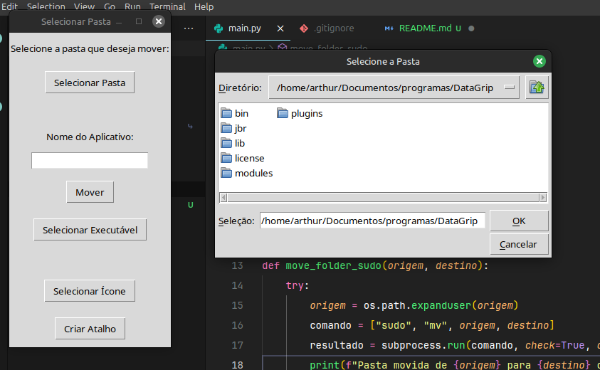
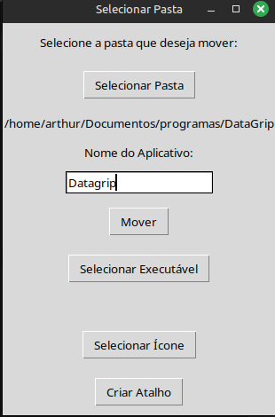

# [PORTUGUESE]

# Sumário
- [Introdução](#pydesk)
- [Como funciona](#como-funciona)
- [Como rodar](#como-rodar-o-projeto)
- [English version](#english)

<br>

# Pydesk
O Pydesk é um projeto que decidi criar para facilicar a criação de atalhos de programas no linux.

Alguns programas para linux não possuem instaladores, normalmente, eles vêm em pacotes com extensão ___.tar.gz___, então, você precisa ir manualmente procurar algum arquivo executável, como ___.sh___ ou ___.Appmage___. Caso você queira criar um atalho, deverá mover os arquivos do programa para a pasta ___/opt___ e criar um atalho na pasta ___/applications___, no caso do Linux Mint, mas isso é um processo muito trabalhoso, visto que outras configurações na criação do atalho são necessárias.

A partir disso, criei este projeto, onde basta você selecionar onde está a pasta dos arquivos de seu programa, qual nome e imagem deverá ter o ícone e criar o atalho. Pronto, atalho criado!

# Como funciona
1. Selecione onde está a pasta dos arquivos do programa. Neste caso, estou usando o ___DataGrip___ como exemplo.<br>



2. Digite o nome do programa.<br>



3. Clique no botão ___mover___.<br>

4. Selecione o executável do programa. Neste caso, está dentro de bin/____datagrip.sh___.<br>

5. Clique no botão ___Criar Atalho___. Pronto, tudo criado!

# Como rodar o projeto
1. Clone o repositório em sua máquina <br>

```bash
git clone git@github.com:Arthur-Llevy/PyDesk.git
```

2. Baixe as dependências do projeto
```bash
pip install -r requirements.txt
```

Ou
```bash
pip3 install -r requirements.txt
```

3. Execute o projeto
```bash
python main.py
```

Ou
```bash
python3 main.py
```

<br>

# [ENGLISH]

# Summary
- [Introduction](#pydesk-1)
- [How it works](#how-it-works)
- [How to run](#how-to-run-the-project)
- [Portuguese version](#portuguese)

<br>

# Pydesk
Pydesk is a project I decided to create to make it easier to create program shortcuts on Linux.

Some Linux programs do not have installers, they usually come in packages with the ___.tar.gz___ extension, so you need to manually look for an executable file, such as ___.sh___ or ___.Appmage___. If you want to create a shortcut, you must move the program files to the ___/opt___ folder and create a shortcut in the ___/applications___ folder, in the case of Linux Mint, but this is a very laborious process, since other configurations are necessary when creating the shortcut.

From there, I created this project, where you just need to select where the program's files folder is, what name and image the icon should have, and create the shortcut. That's it, shortcut created!

# How it works
1. Select where the program's files folder is. In this case, I'm using ___DataGrip___ as an example.<br>


2. Type the program's name.<br>


3. Click the ___move___ button.<br>

4. Select the program's executable. In this case, it's inside bin/____datagrip.sh___.<br>

5. Click the ___Create Shortcut___ button. That's it, everything created!

# How to run the project
1. Clone the repository on your machine <br>

```bash
git clone git@github.com:Arthur-Llevy/PyDesk.git
```

2. Download the project dependencies
```bash
pip install -r requirements.txt
```

Or
```bash
pip3 install -r requirements.txt
```

3. Run the project
```bash
python main.py
```

Or
```bash
python3 main.py
```

<br>
